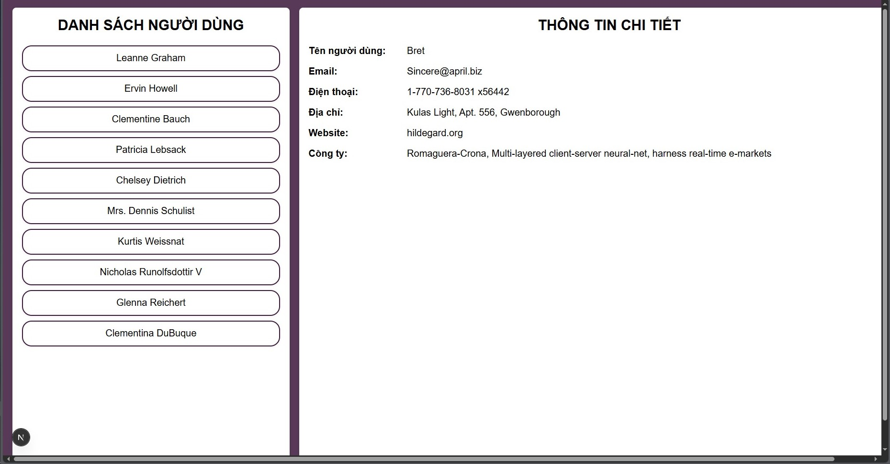

Đối với Câu 4:
B1: Mở thư mục Cau_4 bằng VS Code
B2: Mở terminal và nhập "cd user-list-app"
B3: Nhập "npm run dev"
B4: Sau khi chương trình chạy, tiến hành chọn 1 trong 2 đường link Local hoặc Network để đi tới trang Web.

Đối với câu 5:
B1: Mở thư mục Cau_5 bằng VS Code
B2: Mở terminal và nhập "cd send-form-app"
B3: Nhập "npm run dev"
B4: Sau khi chương trình chạy, tiến hành chọn 1 trong 2 đường link Local hoặc Network để đi tới trang Web.
